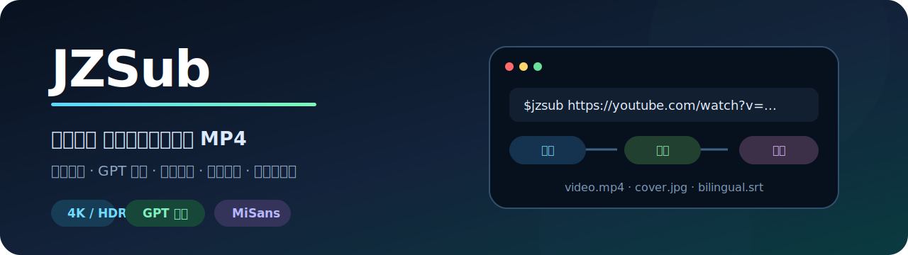
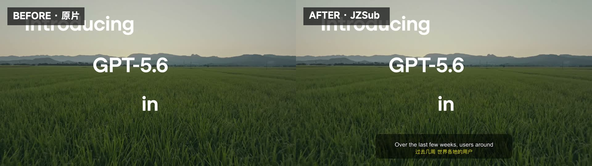
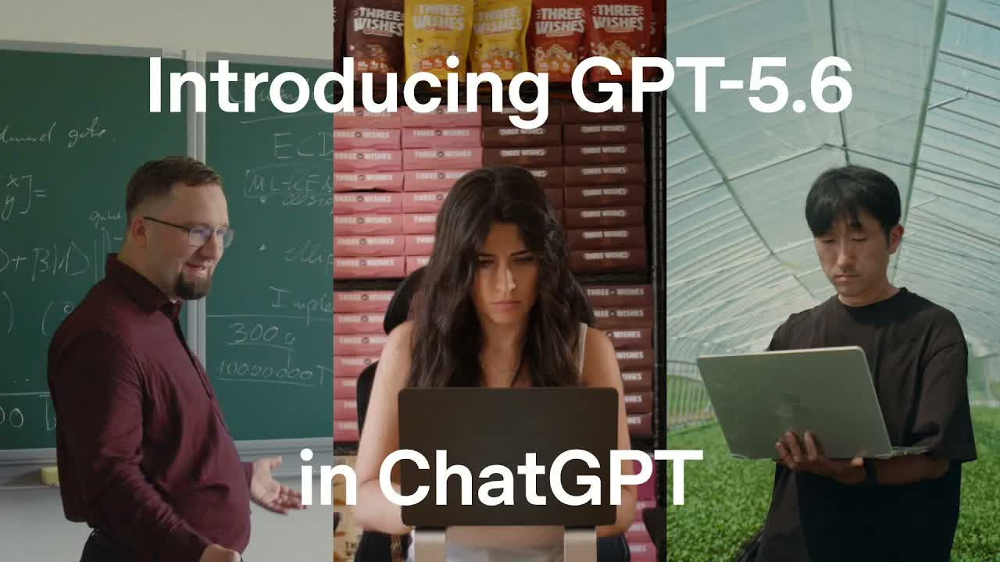
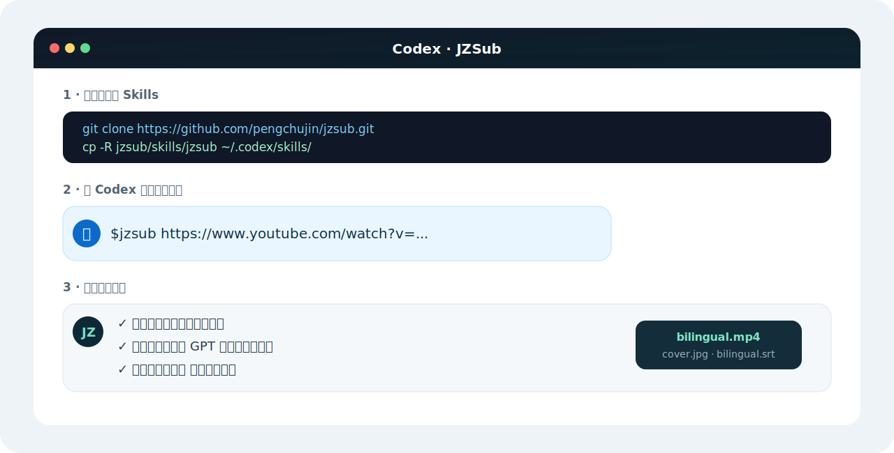

<p align="center">
  
</p>

<p align="center">
  <a href="https://github.com/pengchujin/jzsub/releases/latest"></a>
  <a href="LICENSE"></a>
  
  
</p>

<p align="center"><b>给 JZSub 一个视频链接，拿回最高画质视频、封面、双语字幕和烧录完成的 MP4。</b></p>

## 支持的平台

<table align="center">
  <tr>
    <td align="center" width="110"><br><sub>YouTube</sub></td>
    <td align="center" width="110"><br><sub>Bilibili</sub></td>
    <td align="center" width="110"><br><sub>Vimeo</sub></td>
    <td align="center" width="110"><br><sub>Twitch</sub></td>
    <td align="center" width="110"><br><sub>Dailymotion</sub></td>
    <td align="center" width="110"><br><sub>TikTok</sub></td>
  </tr>
</table>

<p align="center"><sub>以及 yt-dlp 支持的其他站点。实际可用格式、字幕和登录要求由平台决定。</sub></p>

## 主要功能

- **最高画质**：下载最佳视频与音频，尽可能无损封装 MP4
- **按需交付**：`--deliver` 可选完整烧录、仅视频（含原始字幕文件）、仅原始字幕、或双语字幕文件
- **双语字幕**：紧凑分批翻译、批间上下文衔接，再按句子边界重新切分；原文保持不变。默认译成中文，`--target-lang` 可指定日语、法语等任意目标语言
- **自动烧录**：MiSans 字幕、底部双语堆叠、自适应竖屏、精确背景、libass 渲染
- **低耗运行**：只读取紧凑字幕文档，不读取完整清单；烧录每 5% 显示一次进度
- **封面直取**：自动下载并转换为 JPEG
- **静默登录**：需要时直接读取 Chrome 登录态，不导出 Cookie
- **无字幕也能用**：平台没有字幕时直接交付视频、MP4 和封面

```text
烧录 [██████████░░░░░░░░░░]  50%  01:11 / 02:23  0.68x
```

## 视频前后对比

<p align="center">
  
</p>

<p align="center"><sub>左：下载后的原片　·　右：JZSub 生成并烧录的原文＋中文双语字幕</sub></p>

## 封面自动获取

<table>
  <tr>
    <td width="64%"></td>
    <td valign="middle">
      <h3>与视频一起交付</h3>
      <p><code>cover.jpg</code></p>
      <p>自动选择平台封面并转换为通用 JPEG，无需另存网页图片。</p>
    </td>
  </tr>
</table>

## 在 Codex 中使用

<p align="center">
  
</p>

```bash
git clone https://github.com/pengchujin/jzsub.git
mkdir -p ~/.codex/skills
cp -R jzsub/skills/jzsub ~/.codex/skills/
```

在 Codex 新任务中发送：

```text
$jzsub https://www.youtube.com/watch?v=VIDEO_ID
```

JZSub 会持续执行下载、模型翻译、字幕渲染、烧录与交付检查。翻译通过紧凑队列逐批进行，不读取完整字幕清单，也不会停在仅下载完成的中间状态。

## 按需交付

告诉 agent 你只要什么，它会选择对应的 `--deliver` 目标；也可以直接运行脚本：

| 目标 | 说明 | 产物 |
|---|---|---|
| `full`（默认） | 完整流水线 | 视频、封面、字幕、双语烧录 MP4 |
| `video` | 只要视频，不翻译不烧录 | 视频、封面，平台有字幕时同样保存原始字幕文件 |
| `subs` | 只要字幕，不下载视频流 | 原始字幕 + 衍生 SRT |
| `bilingual-subs` | 只要双语字幕文件 | 原始字幕 + 翻译渲染的双语 SRT/ASS，不下载视频 |

```bash
python3 skills/jzsub/scripts/fetch_video.py "<url>" \
  --output-dir job --deliver video --browser-cookies auto
```

`video` 与 `subs` 下载完成即结束；`full` 与 `bilingual-subs` 会继续翻译流程，交付检查按声明的目标判定完成。`subs` 类目标在平台没有合适字幕时会明确报错。

## 依赖

Python 3.10+、yt-dlp、Deno 2.3+、带 libass 的 FFmpeg/ffprobe，以及 MiSans Bold。macOS 可运行：

```bash
brew install yt-dlp ffmpeg-full deno
```

MiSans 请从[小米 HyperOS 官方页面](https://hyperos.mi.com/font/zh/download/)获取；字体文件不包含在本仓库中。

> 仅下载你有权访问和保存的内容。JZSub 不绕过 DRM、付费墙、验证码或平台安全限制。

<details>
<summary>开发者验证</summary>

```bash
python3 skills/jzsub/scripts/fetch_video.py --self-test
python3 -m unittest discover -s skills/jzsub/tests -v
```

</details>

## License

[MIT](LICENSE) · 平台 Logo 与商标归各自权利人所有。
